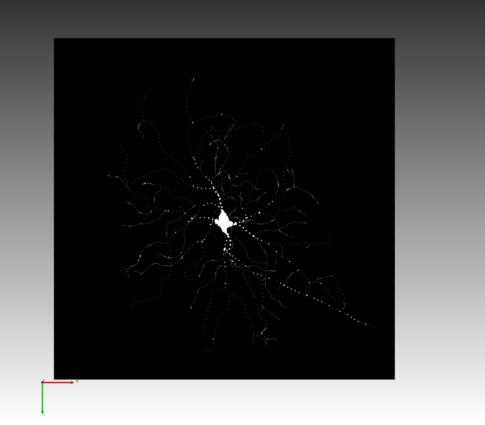

**README**
================

**swc2tiff.py**
================

A Python version of [this](https://github.com/imadtoubal/swc-to-tif/tree/master) utility for converting SWC (neuron reconstruction) files to TIFF stacks. The C++ version of this utility exits with a segmentation fault for some input SWC files. This Python version is a workaround for that issue, while using `tifffile` (makes it nicer to read and write TIFFs).

**Table of Contents**
-----------------

* [Usage](#usage)
* [Requirements](#requirements)
* [Known Issues](#known-issues)
* [Acknowledgments](#acknowledgments)
* [Example Output](#example-output)

**Usage**
---------

This utility can be used in one of two ways:
1. Via command line
```bash
python swc2tiff.py <tiff_file.tif> <swc_file.swc> <out_file.tif>
```
2. As a Python module
```bash
from swc2tiff import swc2tiff

args = ['tiff_file.tif', 'swc_file.swc', 'out_file.tif']
swc2tiff(args)
```

**Requirements**
---------------

* Python 3.8 or higher
* NumPy
* Tifffile

**Known Issues**
-----------------

* This utility assumes that the input SWC file is a neuron reconstruction file with `x`, `y`, `z` coordinates and a `radius` column.


**Acknowledgments**
------------------

- The C++ [SWC2Tiff](https://github.com/imadtoubal/swc-to-tif/tree/master) utility.

**Example Output**
------------------

A neuron from a Vaa3D raw file converted to a TIFF stack:

**Neuron from Vaa3D raw file**


**Neuron TIFF stack**


**Layered neurons**

